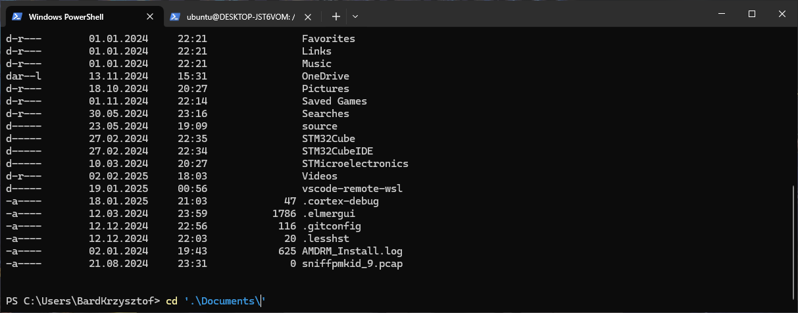

# Zapoznianie uczestnika z założeniami kursu
## Skrypt zajęć
Na początku zajęć trener wita uczestników i zaczyna od przedstawienia ogólnego planu kursu. Prosi grupę o chwilę uwagi, aby omówić, jak będą przebiegać poszczególne spotkania – informuje, ile godzin trwa każde zajęcia oraz przedstawia sposób, w jaki będą one prowadzone. W trakcie tej części trener stara się nawiązać interakcję z uczestnikami, pytając ich o oczekiwania i preferencje dotyczące nauki, co ma na celu dostosowanie tempa i metod pracy do potrzeb grupy. Następnie trener przechodzi do omówienia podstawowych pojęć związanych z programowaniem i algorytmiką. W przystępny sposób wyjaśnia, czym jest programowanie, nawiązując do codziennych przykładów – takich jak poranna rutyna czy proces uruchomienia bądź naprawy samochodu – co ma pomóc uczestnikom zrozumieć, że algorytmy są obecne w niemal każdej dziedzinie życia. Trener akcentuje, że programowanie to sposób na rozwiązywanie problemów poprzez określenie precyzyjnych kroków, które komputer ma wykonać. Kolejnym etapem jest wyjaśnienie roli języka Python w kontekście kursu. Trener opowiada, gdzie Python znajduje zastosowanie – od tworzenia aplikacji internetowych, przez systemy wbudowane, aż po zaawansowane zastosowania w sztucznej inteligencji, analizie danych oraz automatyzacji. W trakcie tego fragmentu trener podkreśla, że popularność Pythona wynika przede wszystkim z jego prostoty, przejrzystej składni, która przypomina język angielski, oraz łatwości uruchomienia programów. Wszystko to sprawia, że Python jest wszechstronnym narzędziem, idealnym zarówno dla początkujących, jak i zaawansowanych programistów. Na zakończenie trener omawia zalety i wady języka Python. Z jednej strony zwraca uwagę na liczne atuty: prostotę nauki dzięki przyjaznej składni, wszechstronność zastosowań, bogate wsparcie ze strony popularnych edytorów, ogromną liczbę dostępnych bibliotek oraz dużą społeczność, która zawsze służy pomocą. Z drugiej strony trener uczciwie przedstawia również ograniczenia Pythona – informuje uczestników, że mimo licznych zalet, Python może zużywać więcej zasobów przy uruchamianiu na mniej typowych urządzeniach, nie zawsze jest optymalny dla zadań wymagających dużej mocy obliczeniowej, a w większych projektach mogą pojawić się problemy związane z zarządzaniem zależnościami oraz kompatybilnością między różnymi wersjami języka.

## Wskazówki dla trenera
- Utrzymuj kontakt wzrokowy i energiczny ton, aby zaangażować grupę.
- W sekcji dyskusyjnych zadawaj pytania otwarte (np. „Jak myślicie, dlaczego Python jest używany w NASA?”).
- Jeśli uczestnicy są mało rozmowni, sam podawaj przykłady – np. „Python jest jak szwajcarski scyzoryk: nie zawsze idealny, ale zawsze przydatny”.
- Unikaj żargonu technicznego lub ogranicz go do minimum – tłumacz terminy (np. „biblioteka” to gotowe narzędzia do konkretnych zadań). 


# Instalacja Pythona w systemie Windows i Linux
## Skrypt zajęć
Trener rozpoczyna od wyjaśnienia, że Python działa na różnych systemach operacyjnych, ale proces instalacji różni się w zależności od platformy. Najpopularniejsze z nich czyli Windows i Linux zostaną zaprezentowane. Informuje on także, że w procesie instalacji konieczna jest podstawowa umiejętność poruszania się po terminalu. Trener powinnien w skrócie wytłumaczyć czym jest terminal. Może to zrobić tłumacząc go jako interfejs bezpośredniej komunikacji pomiędzy rdzeniem (żeby nie używać słowa jądrem) systemu a użytkownikiem. Jeżeli trener zna historię informatyki, może wytłumaczyć jego pochodzenie i dlaczego jest obecny w systemach do dziś. Nastęnie, na tablicy wypisuje komendy: 
- **pwd** - wypisanie ścieżki w jakiej aktualnie się znajduje

*Zdj 1.1 Przykład użycia:*


- **ls (linux) / dir (win)** - wyświetlenie zawartości folderu w którym aktualnie się znajdujemy

*Zdj 1.2 Przykład użycia: (win)*


*Zdj 1.3 Przykład użycia: (linux)*


**cd** - zmiana katalogu w którym się aktualnie znajduje 

*Zdj 1.4 Przykład użycia: (win)*


*Zdj 1.5 przykład użycia: (linux)*


Od kursantów może pojawić się pytanie dotyczące kropkek "." przy nazwach plików lub folderów. Generalna zasada jest następująca:

- **.** - wskazanie na aktualny folder
- **..** - wskazanie na wyższy folder
- **.plik.txt** - plik lub folder który jest "ukryty". Zazwyczaj przechowuje dane konfiguracyjne projektów lub aplikacji. 

Trener może zaprezentować użycie kropek poprzez przykład zmiany folderu w jakim aktualnie się znajduje. 

Następnie trener przechodzi do demonstracji instalacji Pythona na różnych systemach operacyjnych. W systemie Linux, na przykład w Ubuntu, pokazuje, jak za pomocą polecenia w terminalu można zainstalować wybraną wersję Pythona. Podczas tej demonstracji trener wyjaśnia, że instalacja przez menedżera pakietów jest często najprostszym sposobem na szybkie uruchomienie interpretera Pythona w środowisku Linux. Aby zainstalować interpreter pythona należy skorzystać z poniższych poleceń: 

*Polecenie*
```
sudo apt install python3
```
*Zdj 1.6 Przykład użycia*


*Polecenie*
```
sudo apt install python3.11
```
*Zdj 1.7 Przykład użycia*


Wśród uczestników, mogą pojawić się pytania dotyczące słów kluczowych "sudo" lub "apt". Trener może użyć poniższego tłumaczenia, że: 
- **sudo** - "super user do" wykonaj polecenie jako super uzytkownik, analogia do windowsowego okienka instalacji jako admin
- **apt install** - za pomocą menadżera pakietów zainstaluj paczkę/aplikację następującą po spacji "apt" jest menadżerem pakietów typowy dla popularnych dystrybucji linuxa np. Ubuntu mogą być inne menadżery np "dnf" w dystrybucji Fedora lub "yum" w Arch

Kolejnym krokiem jest pokaz instalacji Pythona w systemie Windows. Trener demonstruje, jak pobrać instalator ze strony python.org i uruchomić go, zwracając szczególną uwagę na etap dodania ścieżki instalacji Pythona do zmiennych systemowych. Podkreśla, że jest to krok kluczowy, ponieważ pozwala na korzystanie z Pythona z poziomu wiersza poleceń. Po zakończeniu instalacji trener informuje o konieczności restartu systemu, aby zmiany w zmiennych środowiskowych zostały w pełni zastosowane, a następnie pokazuje, jak w nowo uruchomionej konsoli wpisać polecenie, które uruchamia interpretera (np. „python” lub „python3”). Trener może podążać za poniższymi krokami:

*Zdj 1.8 Pobranie ze strony*


*Zdj 1.9 Instalacja*


*Zdj 1.10 Proces instalacji*


*Zdj 1.11 Sukces instalacji*


Po instalacji, trener może zaprezentować, że interpreter zainstalowanej wersji pythona, pojawi się w zmiennej o nazwie "PATH" wewnątrz zmiennych środowiskowych systemu Windows.

*Zdj 1.12 Sukces instalacji*


Po omówieniu instalacji, trener przechodzi do weryfikacji wersji Pythona. Uczestnikom pokazuje, jak wpisać w terminalu polecenie „python3 --version” (lub „python --version” w Windowsie) i wyjaśnia, jak odczytywać wynik. Podkreśla, że znajomość wersji jest ważna, ponieważ w ekosystemie Pythona funkcjonują różne wersje – najczęściej Python 2.x i Python 3.x – a ich rozróżnienie ma wpływ na kompatybilność instalowanych bibliotek oraz pisany kod.

*Polecenie*
```
 python --version
```
*Zdj 1.13 Przykład użycia* 


Kolejnym tematem jest wprowadzenie do wirtualnych środowisk za pomocą narzędzia venv. Trener tłumaczy, że tworzenie osobnych środowisk dla poszczególnych projektów pozwala uniknąć konfliktów między wersjami bibliotek oraz utrzymać porządek w zależnościach. Pokazuje, jak za pomocą polecenia utworzyć nowe środowisko:

*Polecenie*
```
python -m venv /ścieżka/do/środowiska
``` 
Następnie demonstruje, jak je aktywować – na systemach Linux poleceniem „source /ścieżka/do/środowiska/bin/activate”, a w Windows poprzez „ścieżka\do\środowiska\Scripts\activate.bat”. Trener zwraca uwagę, że korzystanie z wirtualnych środowisk jest najlepszą praktyką w pracy nad projektami, ponieważ zapewnia izolację zależności i ułatwia zarządzanie różnymi wersjami pakietów.

*Polecenie (win)*
```
python -m venv ./sandbox
.\sandbox\Scripts\activate.bat
```
*Zdj 1.14 Przykład użycia (win)*


*Polecenie (linux)*
```
python3 -m venv ./sandbox
source sandbox/bin/activate
```
*Zdj 1.15 Przykład użycia (linux)*


Na końcu tej części trener krótko porusza temat zarządzania wersjami Pythona. Może wspomnieć o narzędziach takich jak pyenv, które pozwalają na łatwe przełączanie się między różnymi wersjami interpretera, co bywa szczególnie przydatne przy pracy nad projektami wymagającymi określonej wersji Pythona.

## Przykładowe zadanie
- "Jeśli masz Linuksa, zainstaluj Python 3.11 komendą sudo apt install python3.11. Sprawdź jego wersję przez python3.11 --version."
- "Na podanej przez trenera ścieżce zainstaluj wirtualne środowisko o nazwie "rapsteam"

## Wskazówki dla trenera
- Jeśli uczestnicy mają problemy z PATH w Windowsie, pokaż screenshoty z konfiguracji.
- Dla ułatwienia, udostępnij gotowe komendy w pliku tekstowym.
- Zachęć do pomocy wzajemnej – np. „Kto już ma działające środowisko, niech pomaga sąsiadowi”.
- Kontroluj, czy wszyscy są na tym samym etapie i czy nikt nie został z tyłu. Jeżeli jest taka potrzeba, wesprzyj indywidualnie taką osobę.
- Możesz przećwiczyć aktywacje i deaktywacje środowiska wirtualnego
- Jeżeli ktoś wyprzedza grupę możesz poprosić go stworzenie dodatkowych wersji pythona, lub zasugerować instalację pakietów bibliotecznych, określić różnicę między venv a pyenv, lub poprosić o sprawdzenie jak wiele miejsca zajmuje środowisko wirtualne i czy to dużó czy nie.